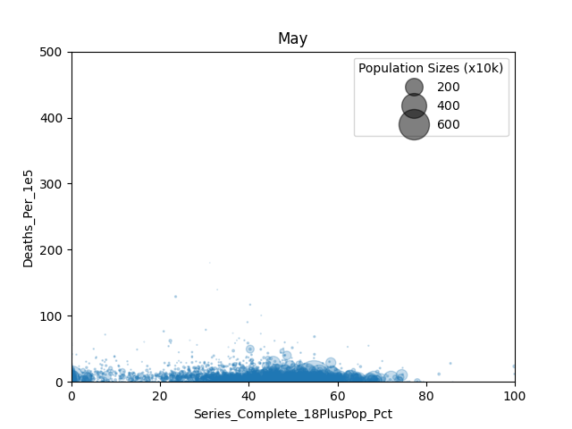
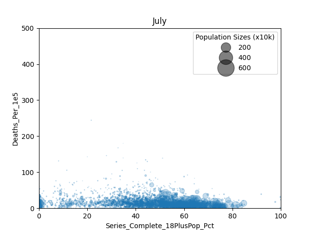
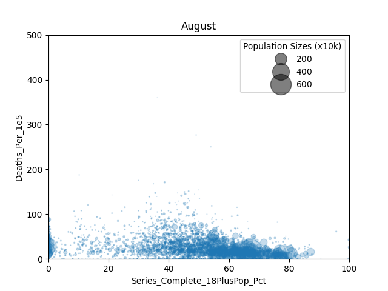
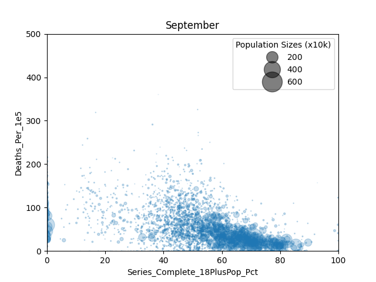
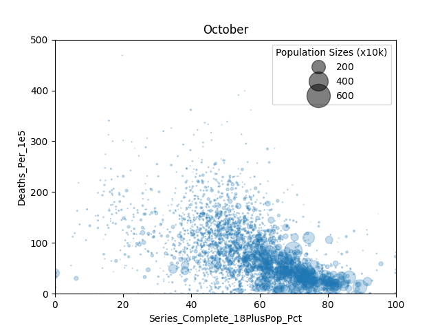
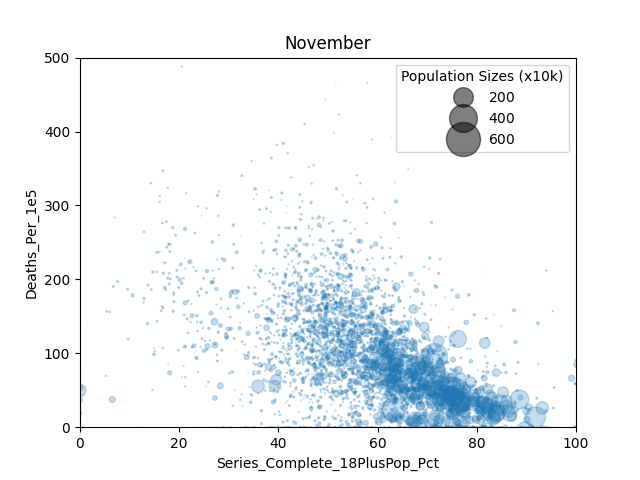

## how to run the code
#### 1.create cdc csv in data/CDC
>If you don't have directory CDC in directory data, go to data
`mkdir CDC`
`cd ..`
Then go to src
`python vaccine`

#### 2.create jhu csv in data/JHU
>If you don't have directory JHU in directory data, go to  data
`mkdir JHU`
`cd ..`
Then go to src
`python vaccines.py`

#### 3.merge cdc data and jhu data. Wrote the merge data in data/Merge
>If you don't have directory Merge in directory data, go to  data
`mkdir Merge`
`cd ..`
Then go to src
`python merge_v2.py`

#### 4. run the code 
`python assignment5_regrade.py`

Please wait five second for each image to show up. They show up in one window. And meanwhile, image for every month will be saved in directory img.
The  November.png in img is scatterplot from colab notebook shared in class

## how I do it 
#### 1.make the code we run in class into a function.
> ```def plot_month(month):```
> parameter: month. You can choose any element in following list as the argument.
`Months = ['May', 'June', 'July', 'August', 'September', 'October', 'November']`

 It's parameter is month. It includes multiple Conditional Statements, so it reads particule csv file according to the argument `month`. Then use the code we wrote in class to plot it out. If you run this function , a window contains image will jump out and stays for 5 seconds. Then the window will close. Because I use the following code instead of ```plt.show() ```     

```
plt.savefig('../img/'+month+'.')
    plt.ion()
    plt.pause(5)
    plt.close()
    # plt.show()
```
#### 2. Then I use a list contains each month, and run the ```plot_month()``` in a for loop.










**For this assignment. I use my JHU_data.py, merge_v2.py and Jerry's  vaccines.py in assignment6**